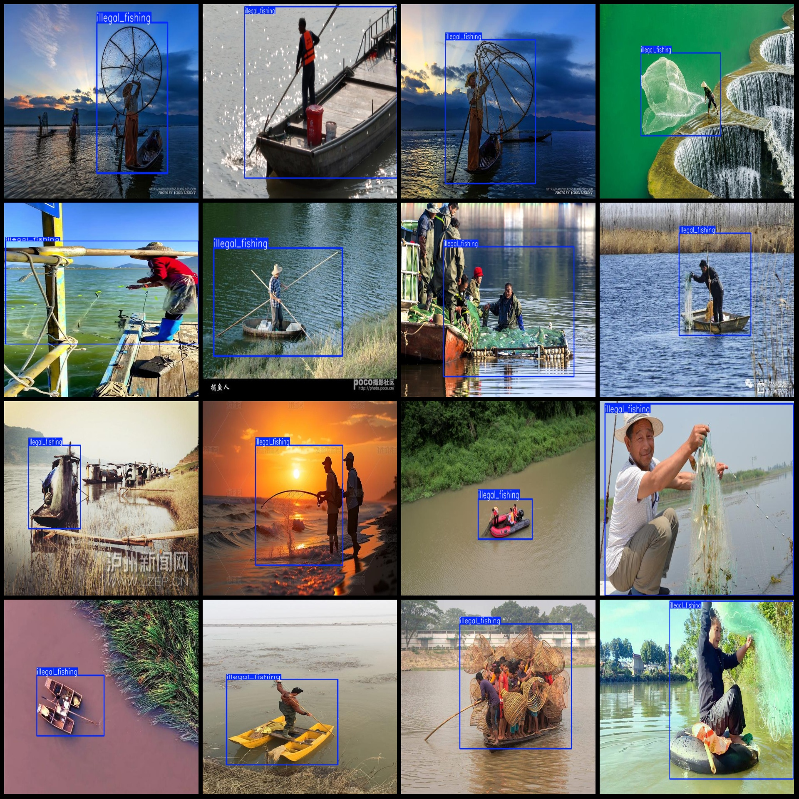
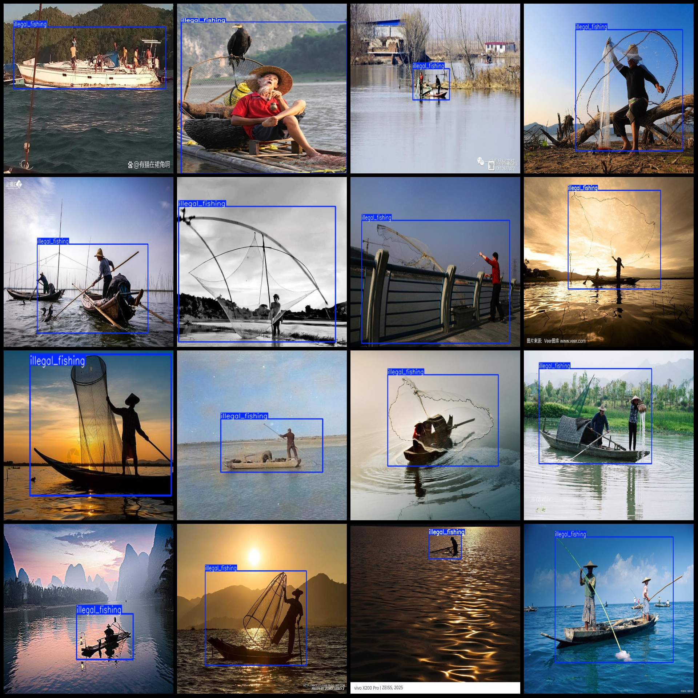

# Illegal Fishing Detection Dataset in Pascal VOC+YOLO Format with 223 Images and 1 Category

Dataset format: Pascal VOC format + YOLO format (txt file without split path, only contains jpg images, corresponding VOC format xml files, and YOLO format txt files)
Number of images (jpg file count): 223
Number of annotations (xml file count): 223
Number of annotations (txt file count): 223
Number of categories: 1
Annotation category name: ["illegal_fishing"]
Number of bounding boxes per category:
- illegal_fishing bounding boxes = 243
Total bounding boxes: 243
Image resolution: Multi-resolution images, such as 570x380, 776x500, etc.
Annotation tool used: labelImg
Annotation rules: Draw a rectangular box for the category
Important notes: None
Special declaration: This dataset does not guarantee the accuracy of the trained models or weight files
Image previews:
Annotation examples:

## Images

Here is a pay link on Stripe ( https://buy.stripe.com/3cs8yP7sY87d0vu9AB ). Please contact me lonlonago@foxmail.com after funding $89, and I will send you a complete data files , thank you!

